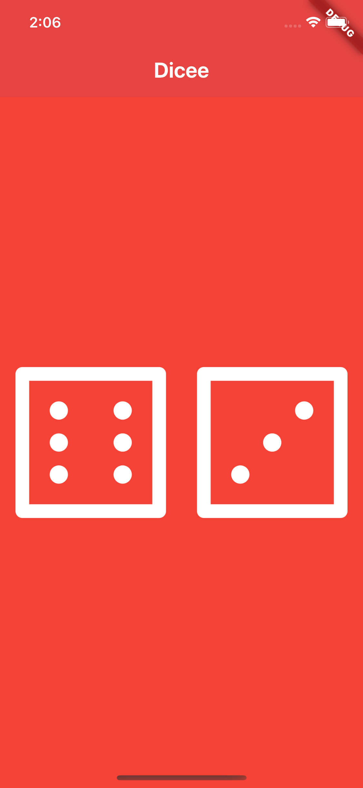

# 🎲 Dicee - Flutter Dice Roller

This is my second Flutter project, **Dicee**, a simple dice rolling app. It displays two dice images, and when you tap on any dice, it randomly changes to a different number.

## 📸 Screenshot



## 🎥 Demo


## 🎯 Features

- 🎲 Two dice images that change randomly on tap
- 🎨 Simple and interactive UI
- 🔄 Uses `Random` to generate random dice rolls
- 🖱️ Tap detection for interactive experience

## 🚀 How to Run

```bash
cd projects/02_dicee
flutter pub get
flutter run
```
