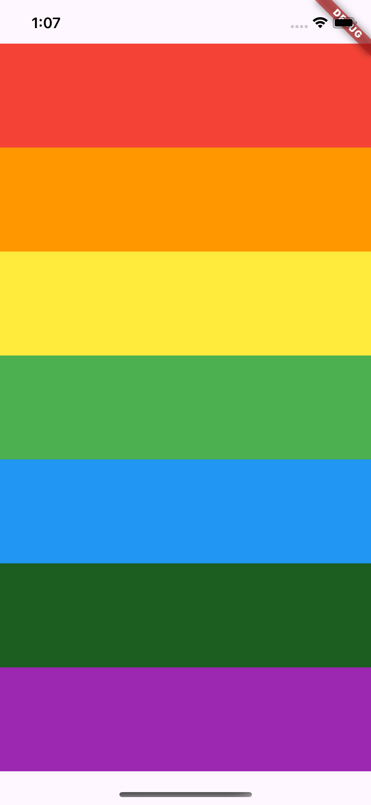

# 🎵 Audio Player - Flutter Package Learning

This is my fourth Flutter project, where I learned how to use **Flutter packages**. I used the **`audioplayers(https://pub.dev/packages/audioplayers)`** package to play local audio files.

## 📸 Screenshot



## 🎯 Features

## 🎥 Demo

[](https://youtube.com/shorts/1tntvMgqahA)

- 🎶 Play local audio files using `audioplayers`
- 🎨 Simple UI with play/pause functionality
- 🔄 Uses Flutter package management

## 🚀 How to Run

```bash
cd projects/04_audio_player
flutter pub get
flutter run
```
