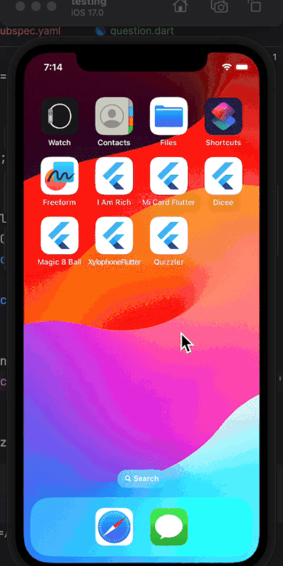

# ❓ Quizzler - A Flutter Quiz App

Quizzler is a fun and interactive quiz app built with Flutter. This project focuses on **Stateful & Stateless Widgets**, **Object-Oriented Programming (OOP)**, and **Flutter package integration**.

## ✨ Features

- ✅ **Quiz with multiple-choice questions**
- ✅ **Tracks progress and displays correct/incorrect answers**
- ✅ **Uses the `rflutter_alert` package** to show an alert when the quiz is completed
- ✅ **Allows users to reset the quiz after completion**
- ✅ **Demonstrates Dart OOP principles: classes, objects, and constructors**
- ✅ **Uses `const`, `final`, and `var` correctly in Dart**

## 📸 Demo



🎥 **[Watch the demo](https://github.com/chloepei867/flutter-learning-hub/raw/main/projects/05_quizzler/screenshots/demo.mp4)**

<video width="400" controls>
  <source src="screenshots/demo.mp4" type="video/mp4">
  Your browser does not support the video tag.
</video>

## 🔧 Tech Used

- **Flutter**
- **Dart**
- **[rflutter_alert 2.0.7](https://pub.dev/packages/rflutter_alert)** → For alert pop-ups when the quiz ends

## 🛠 Installation & Usage

1. **Clone the repository**:
   ```bash
   git clone https://github.com/chloepei867/flutter-learning-hub.git
   cd projects/05_quizzler
   ```
