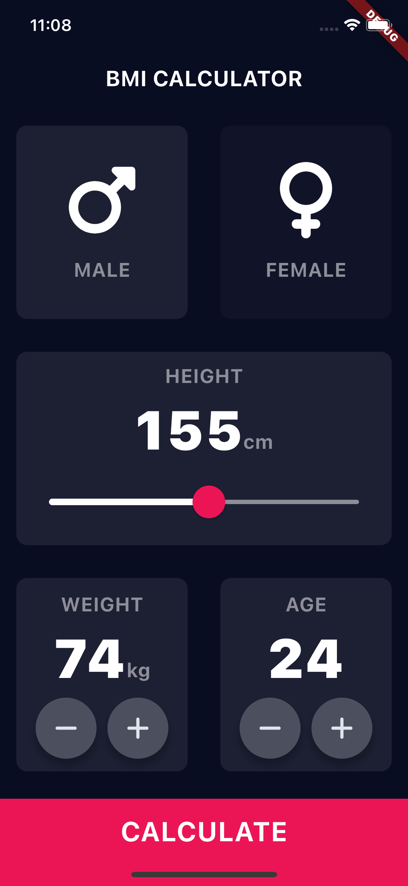
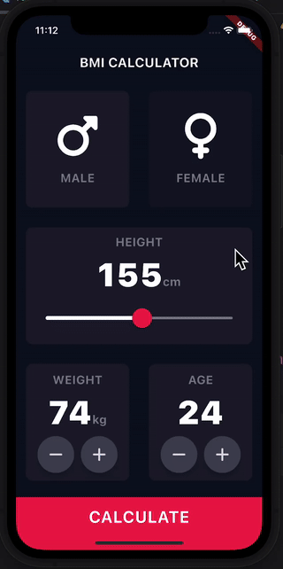

# 📌 BMI Calculator 🏋️‍♂️📊

A simple **Flutter-based BMI Calculator** that allows users to input their height and weight to determine their **Body Mass Index (BMI)** and receive a health classification.

---

## 📱 Features

✅ **User Input** – Enter height (cm) and weight (kg) easily through an intuitive UI.
✅ **Instant BMI Calculation** – Computes BMI dynamically and provides health insights.
✅ **Custom UI Design** – Clean, modern UI built with Flutter widgets.
✅ **Responsive Layout** – Adapts smoothly to different screen sizes.

## 📚Learning

- How to use Flutter Themes
- How refactor Flutter Widgets
- Creating custom Flutter Widgets
- Flutter Slider widget
- Composition vs Inheritance - Building flutter widgets from scratch
- multiple screens using Routes and Navigation

## 🧠 Thought Process

When deciding how to structure the data flow in the **BMI Calculator** app, I considered two main approaches:

1. **Calculating BMI in the Input Screen and Passing the Result to the Result Screen:**

   In this approach, the Input Screen is responsible for calculating the BMI as soon as the user enters their data. The calculated result is then passed to the Result Screen for display. This approach makes the Input Screen the "main logic hub" of the app, which simplifies the Result Screen but could result in excessive logic in the Input Screen.

2. **Passing Data to the Result Screen and Calculating BMI There:**

   Alternatively, I could pass the user’s input (height and weight) to the Result Screen and perform the BMI calculation there. This would keep the Input Screen focused solely on data collection and user interaction, while the Result Screen would handle the logic and display the result. I opted for this approach because it allows for a cleaner separation of concerns between the two screens.

After careful consideration, I chose to implement the second approach, where the Input Screen only collects and passes the data, and the BMI calculation is done in the Result Screen. This structure helps maintain clarity in the code, separating UI and logic concerns, making it easier to manage and scale the app in the future.

## 📸 Screenshots

---

## 🎥 Demo Video

Click below to watch the app in action:

---
