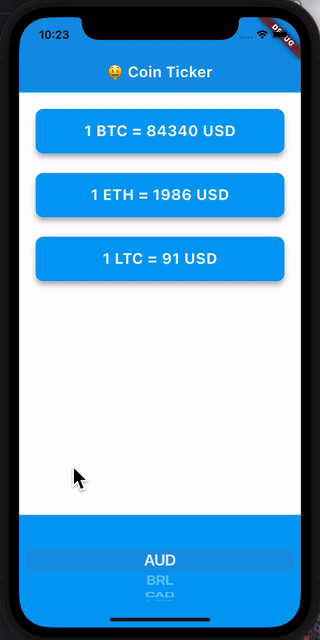

# bitcoin_ticker

This is a crypto currency price checking app that displays the real-time price based on [REST API from CoinAPI.io](https://docs.coinapi.io/exchange-rates-api/rest-api-realtime/exchange-rates).

# What I Learned

- How to use Cupertino and Material widgets in paralle
- How to provide a different user interface depending on the platform

# Demos




# How to Start

Need to provide your api key in coin_data.dart file.

---

# Take Some Notes📚

## Flutter Async State Management

### State Updates with Asynchronous Operations

When working with asynchronous operations in Flutter, it's crucial to properly manage state updates. **A common mistake is failing to update the UI after asynchronous data fetching completes**.

### The Problem

Consider this pattern:

```dart
void onCurrencySelected(String newCurrency) {
  setState(() {
    selectedCurrency = newCurrency;
  });
  fetchData(); // Async operation
}

void fetchData() async {
  final data = await apiCall();
  cryptoToPrice = data; // UI won't update!
}
```

This creates a **timing issue** :

1. `setState()` triggers UI rebuild with the new `selectedCurrency`
2. `fetchData()` starts but returns immediately (it's async)
3. UI rebuilds showing the new currency but with **old price data**
4. When the API call finally completes, the data updates but **no UI refresh happens**

### The Solution

Always call `setState()` after async operations complete:

```dart
void fetchData() async {
  try {
    final data = await apiCall();
    setState(() {
      cryptoToPrice = data;
      isFetchDataSuccessful = true;
    });
  } catch (e) {
    setState(() {
      isFetchDataSuccessful = false;
    });
  }
}
```

### Key Takeaways

1. **Async operations don't automatically trigger UI updates** when they complete
2. Use `setState()` inside the async function after data is received
3. Handle errors with appropriate UI state updates too
4. Consider using loading indicators during data fetching
5. For complex state management, consider using state management solutions like Provider, Riverpod, or BLoC

This pattern ensures your UI always reflects the most current data state.

## Dart Null Safety in Map Access

### Understanding `(map?[key] ?? defaultValue)`

When working with maps in Dart that might be null or might not contain specific keys, the combination of null-aware operators provides elegant error handling.

```dart
final result = (cryptoToPrice?[currency] ?? "N/A");
```

This pattern combines two powerful null safety features:

### 1. Null-aware access operator (`?`)

The `?` operator performs a null check before accessing a property or method:

```dart
cryptoToPrice?[currency]
```

This means:

- If `cryptoToPrice` is null, return null without attempting to access `[currency]`
- If `cryptoToPrice` is not null, attempt to access the value for `currency`

### 2. Null coalescing operator (`??`)

The `??` operator provides a fallback value when the left side is null:

```dart
someValue ?? defaultValue
```

This means:

- If `someValue` is null, return `defaultValue`
- Otherwise, return `someValue`

### Combined power

The combination handles both potential null cases:

1. The map itself might be null
2. The key might not exist in the map

Without these operators, you would need verbose code like:

```dart
String getRate(String currency) {
  if (cryptoToPrice == null) {
    return "N/A";
  }

  final value = cryptoToPrice[currency];
  if (value == null) {
    return "N/A";
  }

  return value;
}
```

### Benefits

- **Concise code** : One line versus multiple conditional statements
- **Improved readability** : Intention is clear and direct
- **Reduced risk** : No null reference exceptions
- **Chainable** : Can be part of larger expressions

This pattern is especially useful in Flutter when displaying data that might not be available yet, or when working with API responses that have varying structures.
